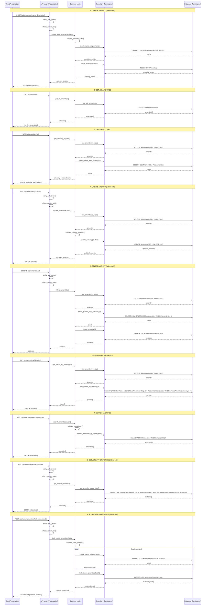

# Amenity API — Sequence Diagram

```mermaid
sequenceDiagram
    participant User as User (Presentation)
    participant API as API Layer (Presentation)
    participant BL as Business Logic
    participant Repo as Repository (Persistence)
    participant DB as Database (Persistence)

%% ================================
%% 1. CREATE AMENITY (ADMIN)
%% ================================
    Note over User,DB: 1. CREATE AMENITY (Admin only)
    User->>API: POST /api/amenities {name, description}
    API->>API: verify_jwt_token()
    API->>API: check_admin_role()
    API->>BL: create_amenity(amenityData)
    BL->>BL: validate_amenity_data()
    BL->>Repo: check_name_unique(name)
    Repo->>DB: SELECT * FROM Amenities WHERE name=?
    DB-->>Repo: result
    Repo-->>BL: exists/not exists
    BL->>Repo: save_amenity(amenity)
    Repo->>DB: INSERT INTO Amenities
    DB-->>Repo: amenity_saved
    Repo-->>BL: amenity_saved
    BL-->>API: amenity_created
    API-->>User: 201 Created {amenity}

%% ================================
%% 2. GET ALL AMENITIES
%% ================================
    Note over User,DB: 2. GET ALL AMENITIES
    User->>API: GET /api/amenities
    API->>BL: get_all_amenities()
    BL->>Repo: find_all_amenities()
    Repo->>DB: SELECT * FROM Amenities
    DB-->>Repo: amenities[]
    Repo-->>BL: amenities[]
    BL-->>API: amenities[]
    API-->>User: 200 OK {amenities[]}

%% ================================
%% 3. GET AMENITY BY ID
%% ================================
    Note over User,DB: 3. GET AMENITY BY ID
    User->>API: GET /api/amenities/{id}
    API->>BL: get_amenity_by_id(id)
    BL->>Repo: find_amenity_by_id(id)
    Repo->>DB: SELECT * FROM Amenities WHERE id=?
    DB-->>Repo: amenity
    Repo-->>BL: amenity
    BL->>Repo: count_places_with_amenity(id)
    Repo->>DB: SELECT COUNT(*) FROM PlaceAmenities
    DB-->>Repo: count
    Repo-->>BL: count
    BL-->>API: amenity + placesCount
    API-->>User: 200 OK {amenity, placesCount}

%% ================================
%% 4. UPDATE AMENITY (ADMIN)
%% ================================
    Note over User,DB: 4. UPDATE AMENITY (Admin only)
    User->>API: PUT /api/amenities/{id} {data}
    API->>API: verify_jwt_token()
    API->>API: check_admin_role()
    API->>BL: update_amenity(id, data)
    BL->>Repo: find_amenity_by_id(id)
    Repo->>DB: SELECT * FROM Amenities WHERE id=?
    DB-->>Repo: amenity
    Repo-->>BL: amenity
    BL->>BL: validate_update_data(data)
    BL->>Repo: update_amenity(id, data)
    Repo->>DB: UPDATE Amenities SET ... WHERE id=?
    DB-->>Repo: updated_amenity
    Repo-->>BL: updated_amenity
    BL-->>API: updated_amenity
    API-->>User: 200 OK {amenity}

%% ================================
%% 5. DELETE AMENITY (ADMIN)
%% ================================
    Note over User,DB: 5. DELETE AMENITY (Admin only)
    User->>API: DELETE /api/amenities/{id}
    API->>API: verify_jwt_token()
    API->>API: check_admin_role()
    API->>BL: delete_amenity(id)
    BL->>Repo: find_amenity_by_id(id)
    Repo->>DB: SELECT * FROM Amenities WHERE id=?
    DB-->>Repo: amenity
    Repo-->>BL: amenity
    BL->>Repo: check_places_using_amenity(id)
    Repo->>DB: SELECT COUNT(*) FROM PlaceAmenities WHERE amenityId = id
    DB-->>Repo: count
    Repo-->>BL: count
    BL->>Repo: delete_amenity(id)
    Repo->>DB: DELETE FROM Amenities WHERE id=?
    DB-->>Repo: success
    Repo-->>BL: success
    BL-->>API: success
    API-->>User: 200 OK

%% ================================
%% 6. GET PLACES BY AMENITY
%% ================================
    Note over User,DB: 6. GET PLACES BY AMENITY
    User->>API: GET /api/amenities/{id}/places
    API->>BL: get_places_by_amenity(id)
    BL->>Repo: find_amenity_by_id(id)
    Repo->>DB: SELECT * FROM Amenities WHERE id=?
    DB-->>Repo: amenity
    Repo-->>BL: amenity
    BL->>Repo: find_places_by_amenity(id)
    Repo->>DB: SELECT p.* FROM Places p JOIN PlaceAmenities ON p.id = PlaceAmenities.placeId WHERE PlaceAmenities.amenityId = id
    DB-->>Repo: places[]
    Repo-->>BL: places[]
    BL-->>API: places[]
    API-->>User: 200 OK {places[]}

%% ================================
%% 7. SEARCH AMENITIES
%% ================================
    Note over User,DB: 7. SEARCH AMENITIES
    User->>API: GET /api/amenities/search?query=wifi
    API->>BL: search_amenities(query)
    BL->>BL: validate_query(query)
    BL->>Repo: search_amenities_by_name(query)
    Repo->>DB: SELECT * FROM Amenities WHERE name LIKE ?
    DB-->>Repo: amenities[]
    Repo-->>BL: amenities[]
    BL-->>API: amenities[]
    API-->>User: 200 OK {amenities[]}

%% ================================
%% 8. GET STATISTICS (ADMIN)
%% ================================
    Note over User,DB: 8. GET AMENITY STATISTICS (Admin only)
    User->>API: GET /api/admin/amenities/statistics
    API->>API: verify_jwt_token()
    API->>API: check_admin_role()
    API->>BL: get_amenity_statistics()
    BL->>Repo: get_amenity_usage_stats()
    Repo->>DB: SELECT a.id, COUNT(pa.placeId) FROM Amenities a LEFT JOIN PlaceAmenities pa ON a.id = pa.amenityId
    DB-->>Repo: statistics[]
    Repo-->>BL: statistics[]
    BL-->>API: statistics[]
    API-->>User: 200 OK {statistics[]}

%% ================================
%% 9. BULK CREATE (ADMIN)
%% ================================
    Note over User,DB: 9. BULK CREATE AMENITIES (Admin only)
    User->>API: POST /api/admin/amenities/bulk {amenities[]}
    API->>API: verify_jwt_token()
    API->>API: check_admin_role()
    API->>BL: bulk_create_amenities(data)
    BL->>BL: validate_bulk_data(data)
    loop each amenity
        BL->>Repo: check_name_unique(name)
        Repo->>DB: SELECT * FROM Amenities WHERE name=?
        DB-->>Repo: result
        Repo-->>BL: exists/not exists
    end
    BL->>Repo: bulk_insert_amenities(batch)
    Repo->>DB: INSERT INTO Amenities (multiple rows)
    DB-->>Repo: success(count)
    Repo-->>BL: success(count)
    BL-->>API: created + skipped
    API-->>User: 201 Created {created, skipped}
```
