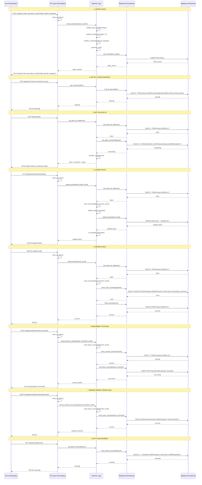

# Places API — Sequence Diagram

```mermaid
sequenceDiagram
    participant User as User (Presentation)
    participant API as API Layer (Presentation)
    participant BL as Business Logic
    participant Repo as Repository (Persistence)
    participant DB as Database (Persistence)

%% ================================
%% 1. CREATE PLACE
%% ================================
    Note over User,DB: 1. CREATE PLACE
    User->>API: POST /api/places {title, description, pricePerNight, latitude, longitude}
    API->>API: verify_jwt_token()
    API->>BL: create_place(placeData, ownerId)
    BL->>BL: validate_place_data(placeData)
    BL->>BL: validate_price(pricePerNight > 0)
    BL->>BL: validate_coordinates(latitude, longitude)
    BL->>BL: generate_uuid()
    BL->>Repo: save_place(place_object)
    Repo->>DB: INSERT INTO Places
    DB-->>Repo: place_saved
    Repo-->>BL: place_saved
    BL-->>API: place_created
    API-->>User: 201 Created {id, title, description, pricePerNight, latitude, longitude}

%% ================================
%% 2. GET ALL PLACES
%% ================================
    Note over User,DB: 2. GET ALL PLACES (with filters)
    User->>API: GET /api/places?minPrice=&maxPrice=&city=
    API->>BL: get_all_places(filters)
    BL->>Repo: find_all_places(filters)
    Repo->>DB: SELECT * FROM Places WHERE pricePerNight BETWEEN minPrice AND maxPrice
    DB-->>Repo: places[]
    Repo-->>BL: places[]
    BL-->>API: places[]
    API-->>User: 200 OK {places[]}

%% ================================
%% 3. GET PLACE BY ID
%% ================================
    Note over User,DB: 3. GET PLACE BY ID
    User->>API: GET /api/places/{id}
    API->>BL: get_place_by_id(placeId)
    BL->>Repo: find_place_by_id(placeId)
    Repo->>DB: SELECT * FROM Places WHERE id=?
    DB-->>Repo: place
    Repo-->>BL: place
    BL->>Repo: get_place_amenities(placeId)
    Repo->>DB: SELECT a.* FROM Amenities a JOIN PlaceAmenities pa WHERE placeId=?
    DB-->>Repo: amenities[]
    Repo-->>BL: amenities[]
    BL->>BL: calculate_rating(placeId)
    BL-->>API: place + amenities + rating
    API-->>User: 200 OK {place details, amenities[], rating}

%% ================================
%% 4. UPDATE PLACE
%% ================================
    Note over User,DB: 4. UPDATE PLACE
    User->>API: PUT /api/places/{id} {fieldsToUpdate}
    API->>API: verify_jwt_token()
    API->>BL: update_place(placeId, data, userId)
    BL->>Repo: find_place_by_id(placeId)
    Repo->>DB: SELECT * FROM Places WHERE id=?
    DB-->>Repo: place
    Repo-->>BL: place
    BL->>BL: verify_ownership(place.ownerId, userId)
    BL->>BL: validate_update_data(data)
    BL->>Repo: update_place(placeId, data)
    Repo->>DB: UPDATE Places SET ... WHERE id=?
    DB-->>Repo: updated_place
    Repo-->>BL: updated_place
    BL->>BL: set_updated_timestamp()
    BL-->>API: updated_place
    API-->>User: 200 OK {updated fields}

%% ================================
%% 5. DELETE PLACE
%% ================================
    Note over User,DB: 5. DELETE PLACE
    User->>API: DELETE /api/places/{id}
    API->>API: verify_jwt_token()
    API->>BL: delete_place(placeId, userId)
    BL->>Repo: find_place_by_id(placeId)
    Repo->>DB: SELECT * FROM Places WHERE id=?
    DB-->>Repo: place
    Repo-->>BL: place
    BL->>BL: verify_ownership(place.ownerId, userId)
    BL->>Repo: check_future_bookings(placeId)
    Repo->>DB: SELECT COUNT(*) FROM Bookings WHERE placeId=? AND status IN ('pending','confirmed')
    DB-->>Repo: count
    Repo-->>BL: count
    BL->>Repo: delete_place(placeId)
    Repo->>DB: DELETE FROM Places WHERE id=?
    DB-->>Repo: success
    Repo-->>BL: success
    BL-->>API: success
    API-->>User: 200 OK

%% ================================
%% 6. ADD AMENITY TO PLACE
%% ================================
    Note over User,DB: 6. ADD AMENITY TO PLACE
    User->>API: POST /api/places/{id}/amenities {amenityId}
    API->>API: verify_jwt_token()
    API->>BL: add_amenity_to_place(placeId, amenityId, userId)
    BL->>BL: verify_place_ownership(placeId, userId)
    BL->>Repo: check_amenity_exists(amenityId)
    Repo->>DB: SELECT * FROM Amenities WHERE id=?
    DB-->>Repo: amenity
    Repo-->>BL: amenity
    BL->>Repo: link_place_amenity(placeId, amenityId)
    Repo->>DB: INSERT INTO PlaceAmenities (placeId, amenityId)
    DB-->>Repo: link_saved
    Repo-->>BL: link_saved
    BL-->>API: amenity_added
    API-->>User: 201 Created {placeId, amenityId}

%% ================================
%% 7. REMOVE AMENITY FROM PLACE
%% ================================
    Note over User,DB: 7. REMOVE AMENITY FROM PLACE
    User->>API: DELETE /api/places/{id}/amenities/{amenityId}
    API->>API: verify_jwt_token()
    API->>BL: remove_amenity_from_place(placeId, amenityId, userId)
    BL->>BL: verify_place_ownership(placeId, userId)
    BL->>Repo: unlink_place_amenity(placeId, amenityId)
    Repo->>DB: DELETE FROM PlaceAmenities WHERE placeId=? AND amenityId=?
    DB-->>Repo: success
    Repo-->>BL: success
    BL-->>API: amenity_removed
    API-->>User: 200 OK

%% ================================
%% 8. GET PLACE REVIEWS
%% ================================
    Note over User,DB: 8. GET PLACE REVIEWS
    User->>API: GET /api/places/{id}/reviews
    API->>BL: get_place_reviews(placeId)
    BL->>Repo: find_reviews_by_place(placeId)
    Repo->>DB: SELECT r.*, u.firstName FROM Reviews r JOIN Users u WHERE placeId=?
    DB-->>Repo: reviews[]
    Repo-->>BL: reviews[]
    BL-->>API: reviews[]
    API-->>User: 200 OK {reviews[]}
```
