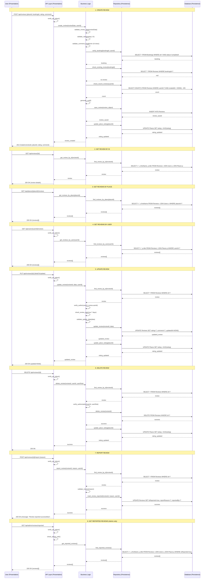

# Reviews API — Sequence Diagram

```mermaid
sequenceDiagram
    participant User as User (Presentation)
    participant API as API Layer (Presentation)
    participant BL as Business Logic
    participant Repo as Repository (Persistence)
    participant DB as Database (Persistence)

%% ================================
%% 1. CREATE REVIEW
%% ================================
    Note over User,DB: 1. CREATE REVIEW
    User->>API: POST /api/reviews {placeId, bookingId, rating, comment}
    API->>API: verify_jwt_token()
    API->>BL: create_review(reviewData, userId)
    BL->>BL: validate_review_data(reviewData)
    BL->>BL: validate_rating(rating 1-5)
    BL->>BL: validate_comment_length(min 10 chars)
    BL->>Repo: verify_booking(bookingId, userId)
    Repo->>DB: SELECT * FROM Bookings WHERE id=? AND status='completed'
    DB-->>Repo: booking
    Repo-->>BL: booking
    BL->>Repo: check_existing_review(bookingId)
    Repo->>DB: SELECT * FROM Reviews WHERE bookingId=?
    DB-->>Repo: null
    Repo-->>BL: no review
    BL->>Repo: check_recent_reviews(userId)
    Repo->>DB: SELECT COUNT(*) FROM Reviews WHERE userId=? AND createdAt > NOW() - 24h
    DB-->>Repo: count
    Repo-->>BL: count
    BL->>BL: generate_uuid()
    BL->>Repo: save_review(review_object)
    Repo->>DB: INSERT INTO Reviews
    DB-->>Repo: review_saved
    Repo-->>BL: review_saved
    BL->>Repo: update_place_rating(placeId)
    Repo->>DB: UPDATE Places SET rating = AVG(rating)
    DB-->>Repo: rating_updated
    Repo-->>BL: rating_updated
    BL-->>API: review_created
    API-->>User: 201 Created {reviewId, placeId, rating, comment}

%% ================================
%% 2. GET REVIEW BY ID
%% ================================
    Note over User,DB: 2. GET REVIEW BY ID
    User->>API: GET /api/reviews/{id}
    API->>BL: get_review_by_id(reviewId)
    BL->>Repo: find_review_by_id(reviewId)
    Repo->>DB: SELECT r.*, u.firstName, p.title FROM Reviews r JOIN Users u JOIN Places p
    DB-->>Repo: review
    Repo-->>BL: review
    BL-->>API: review
    API-->>User: 200 OK {review details}

%% ================================
%% 3. GET REVIEWS BY PLACE
%% ================================
    Note over User,DB: 3. GET REVIEWS BY PLACE
    User->>API: GET /api/places/{placeId}/reviews
    API->>BL: get_reviews_by_place(placeId)
    BL->>Repo: find_reviews_by_place(placeId)
    Repo->>DB: SELECT r.*, u.firstName FROM Reviews r JOIN Users u WHERE placeId=?
    DB-->>Repo: reviews[]
    Repo-->>BL: reviews[]
    BL-->>API: reviews[]
    API-->>User: 200 OK {reviews[]}

%% ================================
%% 4. GET REVIEWS BY USER
%% ================================
    Note over User,DB: 4. GET REVIEWS BY USER
    User->>API: GET /api/users/{userId}/reviews
    API->>API: verify_jwt_token()
    API->>BL: get_reviews_by_user(userId)
    BL->>Repo: find_reviews_by_user(userId)
    Repo->>DB: SELECT r.*, p.title FROM Reviews r JOIN Places p WHERE userId=?
    DB-->>Repo: reviews[]
    Repo-->>BL: reviews[]
    BL-->>API: reviews[]
    API-->>User: 200 OK {reviews[]}

%% ================================
%% 5. UPDATE REVIEW
%% ================================
    Note over User,DB: 5. UPDATE REVIEW
    User->>API: PUT /api/reviews/{id} {fieldsToUpdate}
    API->>API: verify_jwt_token()
    API->>BL: update_review(reviewId, data, userId)
    BL->>Repo: find_review_by_id(reviewId)
    Repo->>DB: SELECT * FROM Reviews WHERE id=?
    DB-->>Repo: review
    Repo-->>BL: review
    BL->>BL: verify_author(userId, review.userId)
    BL->>BL: check_review_age(max 7 days)
    BL->>BL: validate_update_data(data)
    BL->>Repo: update_review(reviewId, data)
    Repo->>DB: UPDATE Reviews SET rating=?, comment=?, updatedAt=NOW()
    DB-->>Repo: updated_review
    Repo-->>BL: updated_review
    BL->>Repo: update_place_rating(placeId)
    Repo->>DB: UPDATE Places SET rating = AVG(rating)
    DB-->>Repo: rating_updated
    Repo-->>BL: rating_updated
    BL-->>API: updated_review
    API-->>User: 200 OK {updated fields}

%% ================================
%% 6. DELETE REVIEW
%% ================================
    Note over User,DB: 6. DELETE REVIEW
    User->>API: DELETE /api/reviews/{id}
    API->>API: verify_jwt_token()
    API->>BL: delete_review(reviewId, userId, userRole)
    BL->>Repo: find_review_by_id(reviewId)
    Repo->>DB: SELECT * FROM Reviews WHERE id=?
    DB-->>Repo: review
    Repo-->>BL: review
    BL->>BL: verify_authorization(userId, userRole)
    BL->>Repo: delete_review(reviewId)
    Repo->>DB: DELETE FROM Reviews WHERE id=?
    DB-->>Repo: success
    Repo-->>BL: success
    BL->>Repo: update_place_rating(placeId)
    Repo->>DB: UPDATE Places SET rating = AVG(rating)
    DB-->>Repo: rating_updated
    Repo-->>BL: rating_updated
    BL-->>API: success
    API-->>User: 200 OK

%% ================================
%% 7. REPORT REVIEW
%% ================================
    Note over User,DB: 7. REPORT REVIEW
    User->>API: POST /api/reviews/{id}/report {reason}
    API->>API: verify_jwt_token()
    API->>BL: report_review(reviewId, reason, userId)
    BL->>Repo: find_review_by_id(reviewId)
    Repo->>DB: SELECT * FROM Reviews WHERE id=?
    DB-->>Repo: review
    Repo-->>BL: review
    BL->>BL: validate_reason(reason)
    BL->>Repo: mark_review_reported(reviewId, reason, userId)
    Repo->>DB: UPDATE Reviews SET isReported=true, reportReason=?, reportedBy=?
    DB-->>Repo: success
    Repo-->>BL: success
    BL-->>API: success
    API-->>User: 200 OK {message: "Review reported successfully"}

%% ================================
%% 8. GET REPORTED REVIEWS (ADMIN)
%% ================================
    Note over User,DB: 8. GET REPORTED REVIEWS (Admin only)
    User->>API: GET /api/admin/reviews/reported
    API->>API: verify_jwt_token()
    API->>API: check_admin_role()
    API->>BL: get_reported_reviews()
    BL->>Repo: find_reported_reviews()
    Repo->>DB: SELECT r.*, u.firstName, p.title FROM Reviews r JOIN Users u JOIN Places p WHERE isReported=true
    DB-->>Repo: reviews[]
    Repo-->>BL: reviews[]
    BL-->>API: reviews[]
    API-->>User: 200 OK {reviews[]}
```
