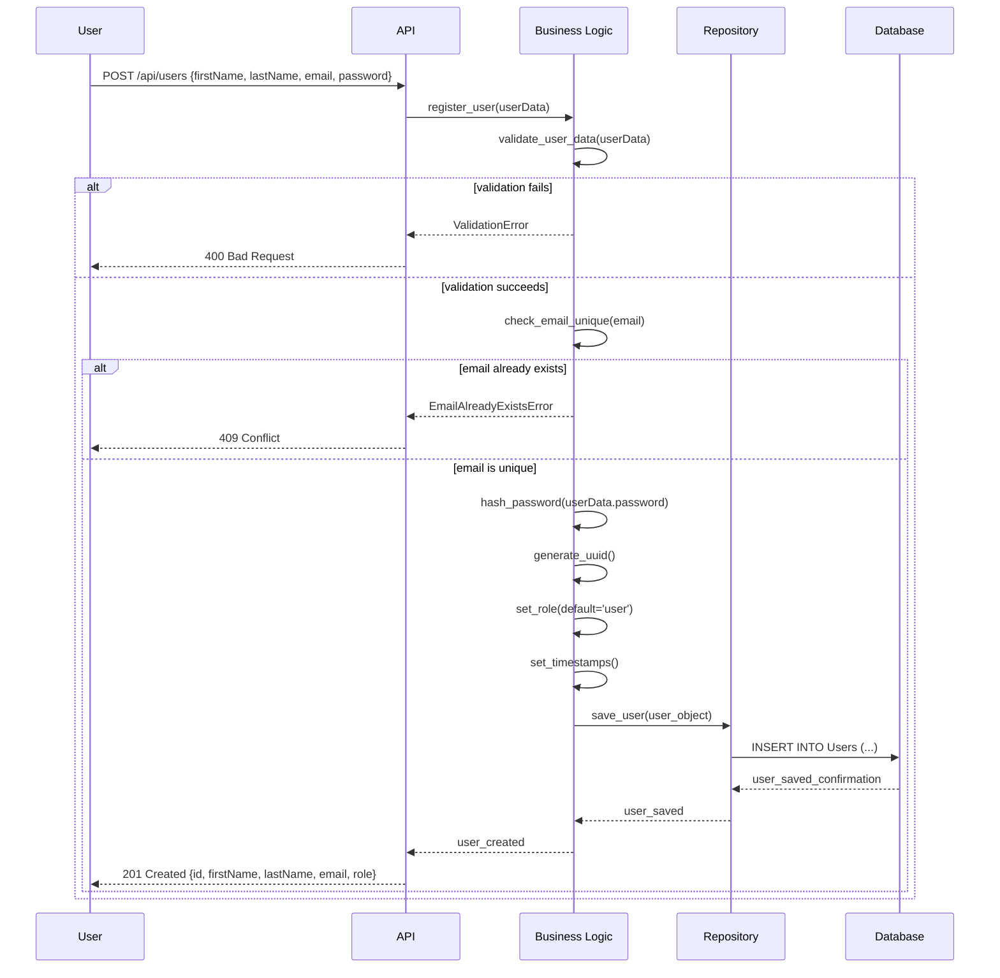
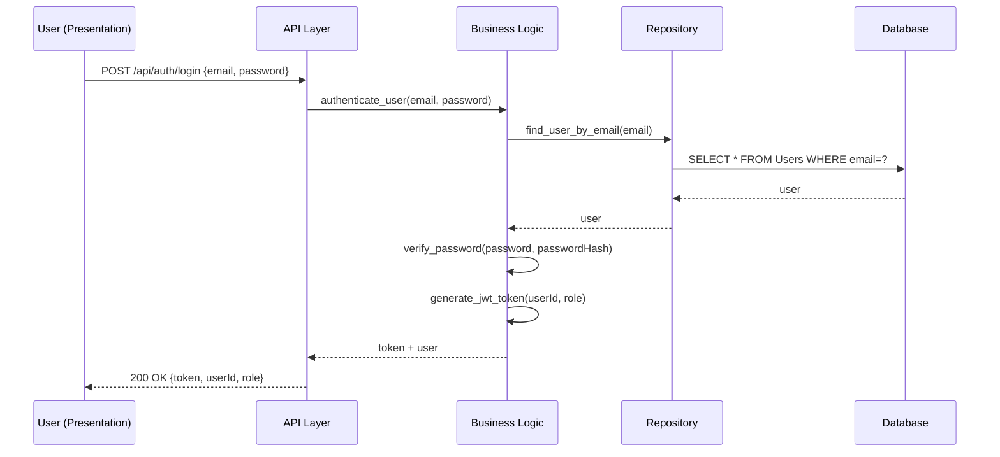

# User API – Sequence Diagrams

```mermaid
sequenceDiagram
    participant User
    participant API
    participant BL as Business Logic
    participant Repo as Repository
    participant DB as Database

%% ================================
%% USER REGISTRATION
%% ================================
User->>API: POST /api/users {firstName, lastName, email, password}
API->>BL: register_user(userData)
BL->>BL: validate_user_data(userData)
alt validation fails
    BL-->>API: ValidationError
    API-->>User: 400 Bad Request
else validation succeeds
    BL->>BL: check_email_unique(email)
    alt email already exists
        BL-->>API: EmailAlreadyExistsError
        API-->>User: 409 Conflict
    else email is unique
        BL->>BL: hash_password(userData.password)
        BL->>BL: generate_uuid()
        BL->>BL: set_role(default='user')
        BL->>BL: set_timestamps()
        BL->>Repo: save_user(user_object)
        Repo->>DB: INSERT INTO Users (...)
        DB-->>Repo: user_saved_confirmation
        Repo-->>BL: user_saved
        BL-->>API: user_created
        API-->>User: 201 Created {id, firstName, lastName, email, role}
    end
end
```

---

```mermaid
sequenceDiagram
    participant User as User (Presentation)
    participant API as API Layer
    participant BL as Business Logic
    participant Repo as Repository
    participant DB as Database

%% ================================
%% USER LOGIN
%% ================================
User->>API: POST /api/auth/login {email, password}
API->>BL: authenticate_user(email, password)
BL->>Repo: find_user_by_email(email)
Repo->>DB: SELECT * FROM Users WHERE email=?
DB-->>Repo: user
Repo-->>BL: user
BL->>BL: verify_password(password, passwordHash)
BL->>BL: generate_jwt_token(userId, role)
BL-->>API: token + user
API-->>User: 200 OK {token, userId, role}
```
