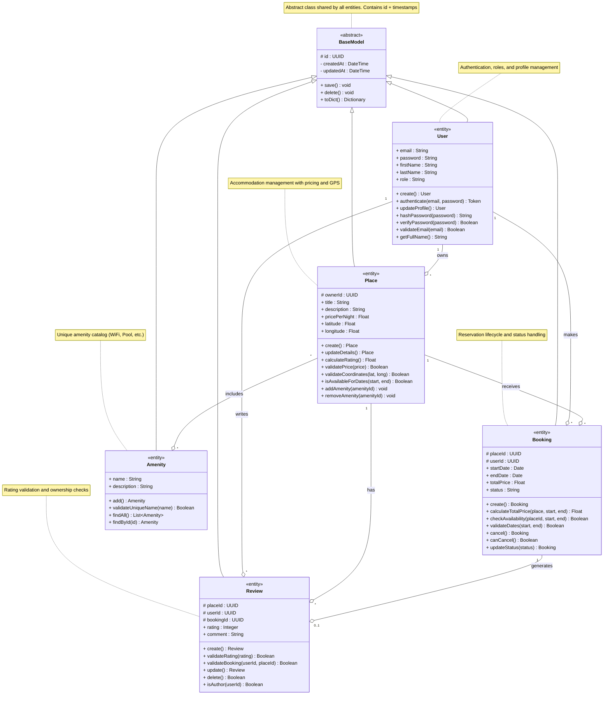

# Domain Model – Class Diagram

```mermaid
classDiagram
%% ===============================================
%% BASE MODEL (Abstract shared class)
%% ===============================================
class BaseModel {
    <<abstract>>
    # id : UUID
    - createdAt : DateTime
    - updatedAt : DateTime
    + save() void
    + delete() void
    + toDict() Dictionary
}

%% ===============================================
%% USER MODEL
%% ===============================================
class User {
    <<entity>>
    + email : String
    + password : String
    + firstName : String
    + lastName : String
    + role : String
    + create() User
    + authenticate(email, password) Token
    + updateProfile() User
    + hashPassword(password) String
    + verifyPassword(password) Boolean
    + validateEmail(email) Boolean
    + getFullName() String
}

%% ===============================================
%% PLACE MODEL
%% ===============================================
class Place {
    <<entity>>
    # ownerId : UUID
    + title : String
    + description : String
    + pricePerNight : Float
    + latitude : Float
    + longitude : Float
    + create() Place
    + updateDetails() Place
    + calculateRating() Float
    + validatePrice(price) Boolean
    + validateCoordinates(lat, long) Boolean
    + isAvailableForDates(start, end) Boolean
    + addAmenity(amenityId) void
    + removeAmenity(amenityId) void
}

%% ===============================================
%% BOOKING MODEL
%% ===============================================
class Booking {
    <<entity>>
    # placeId : UUID
    # userId : UUID
    + startDate : Date
    + endDate : Date
    + totalPrice : Float
    + status : String
    + create() Booking
    + calculateTotalPrice(place, start, end) Float
    + checkAvailability(placeId, start, end) Boolean
    + validateDates(start, end) Boolean
    + cancel() Booking
    + canCancel() Boolean
    + updateStatus(status) Booking
}

%% ===============================================
%% REVIEW MODEL
%% ===============================================
class Review {
    <<entity>>
    # placeId : UUID
    # userId : UUID
    # bookingId : UUID
    + rating : Integer
    + comment : String
    + create() Review
    + validateRating(rating) Boolean
    + validateBooking(userId, placeId) Boolean
    + update() Review
    + delete() Boolean
    + isAuthor(userId) Boolean
}

%% ===============================================
%% AMENITY MODEL
%% ===============================================
class Amenity {
    <<entity>>
    + name : String
    + description : String
    + add() Amenity
    + validateUniqueName(name) Boolean
    + findAll() List~Amenity~
    + findById(id) Amenity
}

%% ===============================================
%% INHERITANCE
%% ===============================================
BaseModel <|-- User
BaseModel <|-- Place
BaseModel <|-- Booking
BaseModel <|-- Review
BaseModel <|-- Amenity

%% ===============================================
%% RELATIONSHIPS
%% ===============================================
User "1" --o "*" Place : owns
User "1" --o "*" Booking : makes
User "1" --o "*" Review : writes

Place "1" --o "*" Booking : receives
Place "1" --o "*" Review : has
Place "*" --o "*" Amenity : includes

Booking "1" --o "0..1" Review : generates

%% ===============================================
%% NOTES
%% ===============================================
note for BaseModel "Abstract class shared by all entities. Contains id + timestamps"
note for User "Authentication, roles, and profile management"
note for Place "Accommodation management with pricing and GPS"
note for Booking "Reservation lifecycle and status handling"
note for Review "Rating validation and ownership checks"
note for Amenity "Unique amenity catalog (WiFi, Pool, etc.)"
```
