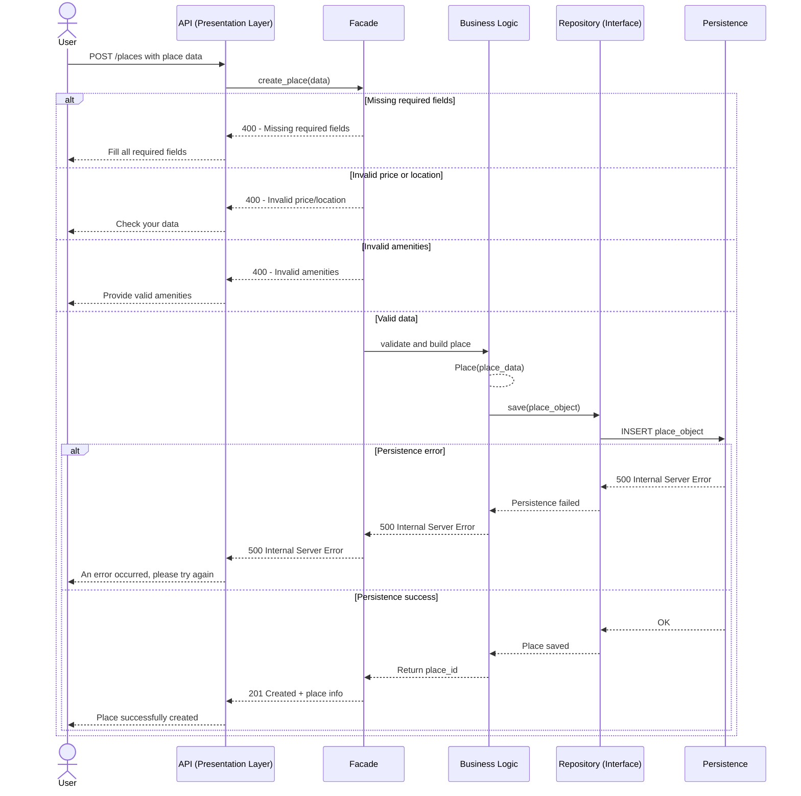
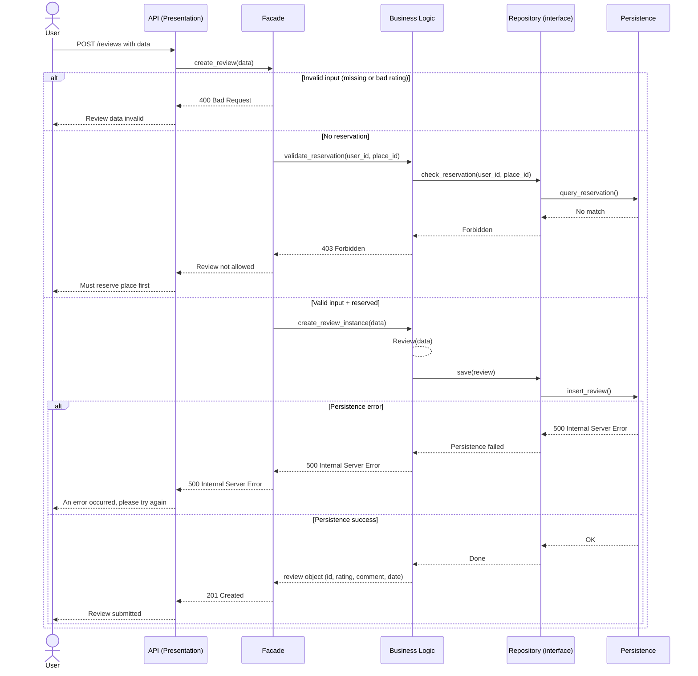
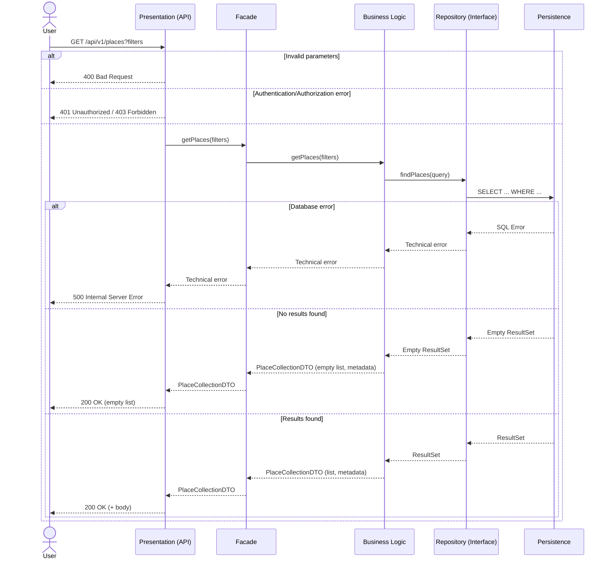

# 1 User Registration

```mermaid
sequenceDiagram
    %% Layers:
    %% Presentation: User, API
    %% Business Logic: Facade, BusinessLogic, Repository
    %% Persistence: Persistence

    actor User
    participant API as API (Presentation Layer)
    participant Facade as "Facade pattern"
    participant BusinessLogic as Business Logic
    participant Repository as "Repository (Interface)"
    participant Persistence as Persistence Layer

    User ->> API: POST /users with data
    API ->> Facade: create_user(data)

    alt "Missing required fields"
        Facade -->> API: 400 Bad Request - Missing fields
        API -->> User: Please fill all required fields
    else "Invalid email format"
        Facade -->> API: 400 Bad Request - Invalid email
        API -->> User: Invalid email address
    else "Password too short"
        Facade -->> API: 400 Bad Request - Weak password
        API -->> User: Password must be at least 8 characters
    else "Email already exists"
        Facade -->> API: 409 Conflict - Email already registered
        API -->> User: Email already in use
    else "Valid data"
        Facade ->> BusinessLogic: create_user_instance(data)
        BusinessLogic --> BusinessLogic: User(user_data)  # Création de l'instance
        BusinessLogic ->> Repository: save(user)
        Repository ->> Persistence: insert_user(user)
        alt "Persistence error"
            Persistence -->> Repository: 500 Internal Server Error
            Repository -->> BusinessLogic: Persistence failed
            BusinessLogic -->> Facade: 500 Internal Server Error
            Facade -->> API: 500 Internal Server Error
            API -->> User: An error occurred, please try again
        else "Persistence success"
            Persistence -->> Repository: OK + user_id
            Repository -->> BusinessLogic: User saved + user_id
            BusinessLogic -->> Facade: return user + user_id
            Facade -->> API: 201 Created + user object
            API -->> User: Success + user_id
        end
```

# 2 Place Creation



# 3 Review Submission



# 4 Fetching List of Places


