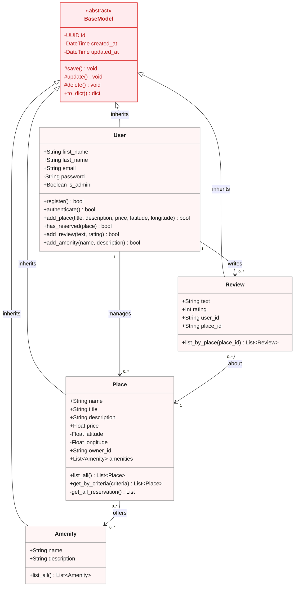

```mermaid
classDiagram
    direction TB

    %% ===================
    %% Base class (shared attributes and methods)
    %% ===================
    class BaseModel {
        <<abstract>>
        -UUID id
        -DateTime created_at
        -DateTime updated_at
        #save() void
        #update() void
        #delete() void
        +to_dict() dict
    }

    %% ===================
    %% User, Place, Review, Amenity classes
    %% ====================
    class User {
        +String first_name
        +String last_name
        +String email
        -String password
        +Boolean is_admin
        +register() bool
        +authenticate() bool
        +add_place(title, description, price, latitude, longitude) bool
        +has_reserved(place) bool
        +add_review(text, rating) bool
        +add_amenity(name, description) bool
    }

    class Place {
        +String name
        +String title
        +String description
        +Float price
        -Float latitude
        -Float longitude
        +String owner_id
        +List~Amenity~ amenities
        +list_all() List~Place~
        +get_by_criteria(criteria) List~Place~
        -get_all_reservation() List
    }

    class Review {
        +String text
        +Int rating
        +String user_id
        +String place_id
        +list_by_place(place_id) List~Review~
    }

    class Amenity {
        +String name
        +String description
        +list_all() List~Amenity~
    }

    %% ===================
    %% Inheritance relationships
    %% ===================
    BaseModel <|-- User : inherits
    BaseModel <|-- Place : inherits
    BaseModel <|-- Review : inherits
    BaseModel <|-- Amenity : inherits

    %% ===================
    %% Associations
    %% ===================
    User "1" --> "0..*" Place : manages
    User "1" --> "0..*" Review : writes
    Place "0..*" --> "0..*" Amenity : offers
    Review "0..*" --> "1" Place : about

    %% ===================
    %% Styling
    %% ===================
    style BaseModel fill:#FFEBEE,stroke:#E13F3F,stroke-width:2px,color:#B71C1C
    style User fill:#FFF5F5,stroke:#9E9E9E,stroke-width:1px,color:#212121
    style Place fill:#FFF5F5,stroke:#9E9E9E,stroke-width:1px,color:#212121
    style Review fill:#FFF5F5,stroke:#9E9E9E,stroke-width:1px,color:#212121
    style Amenity fill:#FFF5F5,stroke:#9E9E9E,stroke-width:1px,color:#212121
```
