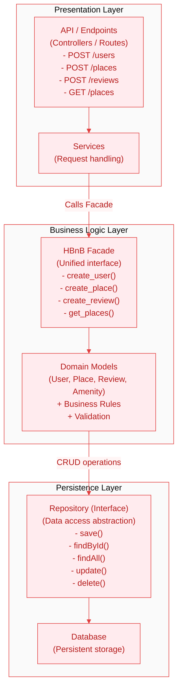

```mermaid
%%{init: {'theme':'base', 'themeVariables': {
  'primaryColor':'#FFEBEE',
  'primaryTextColor':'#B71C1C',
  'primaryBorderColor':'#E13F3F',
  'lineColor':'#E13F3F',
  'secondaryColor':'#FFF5F5',
  'tertiaryColor':'#FAFAFA',
  'clusterBkg':'#FAFAFA',
  'clusterBorder':'#E13F3F'
}}}%%
flowchart TB
    %% ===================
    %% Presentation Layer
    %% ===================
    subgraph P["Presentation Layer"]
        direction TB
        API["API / Endpoints\n(Controllers / Routes)\n- POST /users\n- POST /places\n- POST /reviews\n- GET /places"]
        SVC["Services\n(Request handling)"]
        API --> SVC
    end

    %% ===================
    %% Business Logic Layer
    %% ===================
    subgraph B["Business Logic Layer"]
        direction TB
        FACADE["HBnB Facade\n(Unified interface)\n- create_user()\n- create_place()\n- create_review()\n- get_places()"]
        MODELS["Domain Models\n(User, Place, Review, Amenity)\n+ Business Rules\n+ Validation"]
        FACADE --> MODELS
    end

    %% ===================
    %% Persistence Layer
    %% ===================
    subgraph D["Persistence Layer"]
        direction TB
        REPO["Repository (Interface)\n(Data access abstraction)\n- save()\n- findById()\n- findAll()\n- update()\n- delete()"]
        DB["Database\n(Persistent storage)"]
        REPO --> DB
    end

    %% ===================
    %% Layer Communication (Dependencies)
    %% ===================
    SVC -->|Calls Facade| FACADE
    MODELS -->|CRUD operations| REPO
```
